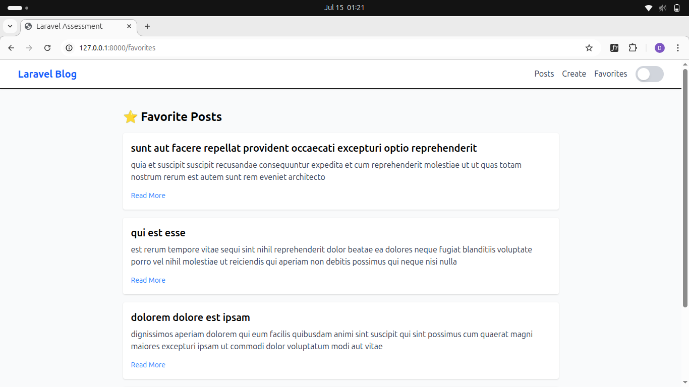

# Laravel Assessment PT. Murni Solusindo Nusantara - JSONPlaceholder Integration

## 📚 Overview

This Laravel application demonstrates API consumption, data manipulation, and frontend development using Blade templating and Tailwind CSS. It integrates with the [JSONPlaceholder API](https://jsonplaceholder.typicode.com/) and simulates a simple blog interface with multiple features.

---

## ⚙️ Setup Instructions

### Requirements

- PHP >= 8.1
- Composer
- Node.js & npm

### Installation

```bash
# Clone the repository
$ git clone https://github.com/daffatabiano/laravel-assesment.git
$ cd laravel-assesment

# Install dependencies
$ composer install
$ npm install && npm run dev

# Set up environment
$ cp .env.example .env
$ php artisan key:generate

# Serve the app
$ php artisan serve
```

---

## ✨ Features Implemented

### 🏠 Home Page

- Display paginated list of posts (10 per page)
- Search by title/content
- Filter by user ID or post ID
- Infinite scroll support
- Favorite posts (stored in localStorage)

### 📄 Post Detail Page

- Full post content
- List of comments
- Favorite toggle

### 👤 User Profile Page

- Display user information
- List of user's posts

### ✍️ Create / Edit Post

- Simulate post creation/editing via API
- Form validation (server-side and optional client-side)

### 🔍 Search & Filter

- Search by post title or body
- Filter by user and post ID

### ☕ UI/UX

- TailwindCSS for styling
- Responsive design with mobile hamburger navigation
- Light/Dark mode toggle (Tailwind 4.1 compatible)
- Blade Components for reusable UI
- Loading spinners and proper error messages

### ⌛ Caching

- API responses cached using Laravel's cache system to minimize repeated calls

---

## 🥬 Technologies Used

- Laravel 10.x
- Tailwind CSS 4.1
- Laravel Blade Templating
- Laravel HTTP Client
- LocalStorage (for Favorites)

---

## 🔠 API Endpoints Utilized

- `GET /posts`
- `GET /posts/{id}`
- `GET /posts/{id}/comments`
- `GET /users/{id}`
- `POST /posts` (simulated)
- `PUT /posts/{id}` (simulated)

---

## 🚫 Error Handling

- API errors displayed via UI alerts
- Fallback UI for failed requests
- Server-side form validation with feedback

---

## ⚡ Performance

- API response caching
- Lazy loading (infinite scroll)

---

## ✨ Advanced Features

- Infinite scroll toggle (alternative to pagination)
- LocalStorage-based favorites system
- Blade components for cards/buttons/navbar
- Tailwind CSS dark/light mode without config file

---

## 📊 Screenshots

*Add screenshots of key pages such as homepage, post detail, user profile, etc.*
### Home Page


### Create Page


### Favorite Page

(public/images/favorites-dark.png)
---

## 🚀 Future Enhancements

- Save favorites to backend DB
- Realtime validation (AJAX)
- Image upload (if switching to another API)
- i18n/multilingual support

---

## 📅 Author

**Your Name**\
GitHub: [@daffatabiano](https://github.com/daffatabiano)\
Email: [daffatabianoo@gmail.com](mailto\:daffatabianoo@gmail.com)

---

## 💡 License

This project is for assessment/demo purposes and is not intended for production use.
